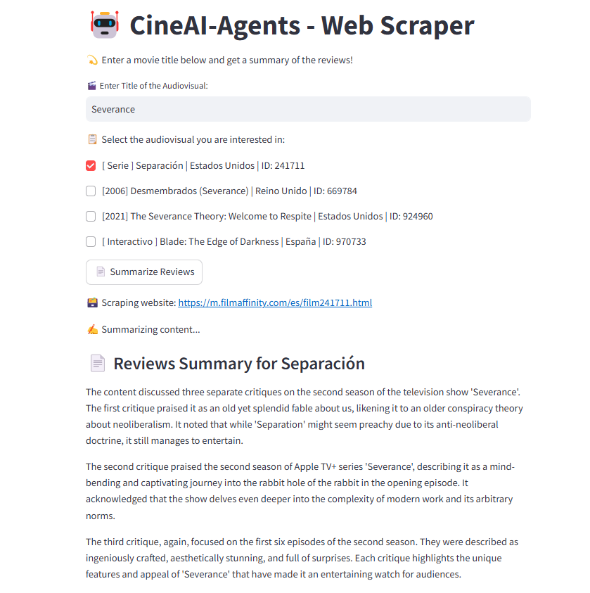

## **Dependencies**

- To run this project, you'll need to install the following dependencies:

```bash
pip install -r requirements.txt
```

- Necessary modifications to `python_filmaffinity`:

After installing `python_filmaffinity`, you need to modify a few lines of code for it to work properly.

Open the python_filmaffinity `pages.py` file (usually located in `Lib/site-packages/python_filmaffinity/pages.py`).

Modify the `get_year` and `get_country` functions to look like this:

```python
def get_year(self):
    """Get the year."""
    cell = self.soup.find('div', {'class': ['mc-data', 'd-flex']})
    return cell.find_all('div')[0].get_text() if cell else self._get_year_from_title()

def get_country(self):
    """Get the country."""
    cell = self.soup.find('div', {'class': ['mc-data', 'd-flex']})
    if not cell:
        return None
    return cell.img['alt']
```

## You Will Need
Node.js version 18 or higher and npm version 7 or higher to complete this guide.

## Run Agent

- To start the AI web scraper, run:
```bash
npm install -g @web3-storage/w3cli
npm i ipfs-car
w3 login tu_email@dominio.com
w3 space create --name "CineAI-Agent"
streamlit run ollama_scraper_faiss.py
```